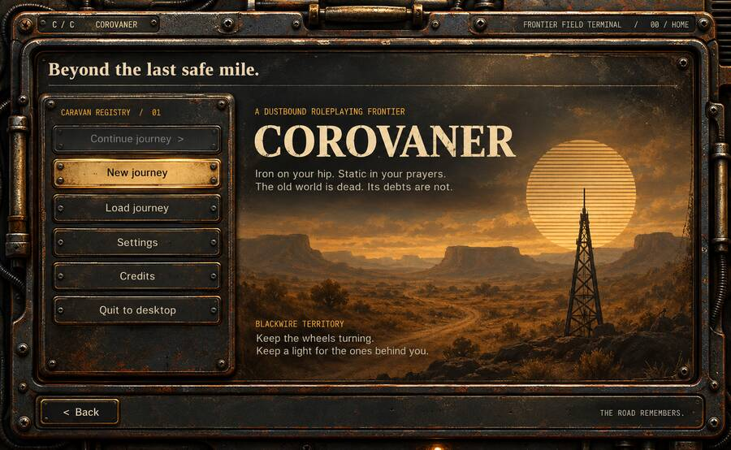

# Corovaner UI architecture

`reference/main-menu.jpg` is the approved visual source of truth for the post-apocalyptic
frontier terminal. It is a design reference, not a runtime screen texture: the actual UI must
remain responsive, localized, keyboard-focusable, and readable at both 1300 x 800 and the
900 x 600 larger-text regression size.

The build excludes `reference/` and architecture Markdown from packaged resources. Runtime
textures remain in `element-set/` and are included in the generated asset list.

## Layer model

1. **World/backdrop** remains independent artwork or the existing contour-line renderer.
2. **Screen chassis** is a nine-slice frame with a transparent center, placed around a menu root.
3. **Content panels** are independent nine-slice surfaces and may grow in either direction.
4. **Controls** use dark and enamel nine-slice plates; labels and state are always live Scene2D data.
5. **Hardware** such as lamps, vents, pipes, and fasteners is fixed-size decoration and must never stretch.

This separation preserves the character of the reference without distorting screws, bevels,
surface wear, or typography.

## Scaling rules

- Keep nine-slice corner sizes unchanged in logical UI pixels.
- Stretch only the quiet center and straight edge regions.
- Do not bake copy, icons, selection state, or focus rings into a base texture.
- Use deterministic tinting for interaction states so every control remains visually consistent.
- Place optional hardware after layout, anchored to corners or rails, with `Touchable.disabled`.
- Hide nonessential hardware before reducing content padding at small resolutions.

## Element roadmap

The first production set is in `element-set/`. Future additions should be created only when a
screen needs them: a compact header rail, toggle switch, scrollbar handle, tooltip pointer,
small/large vent variants, and corner pipe overlays. Each addition must declare whether it is
nine-sliced, tiled, or fixed-size before being wired into `MenuTheme`.

Do not derive layouts by slicing the reference screenshot. Generate or construct clean,
text-free primitives from the reference, validate real transparency, then test them through
the existing menu layout and screenshot harnesses.
