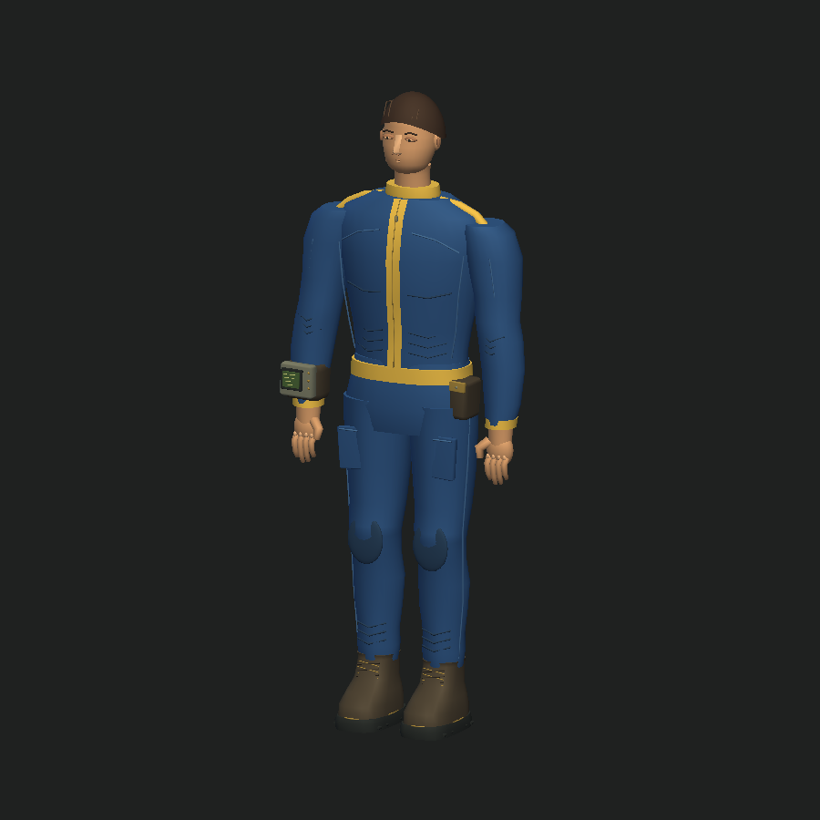
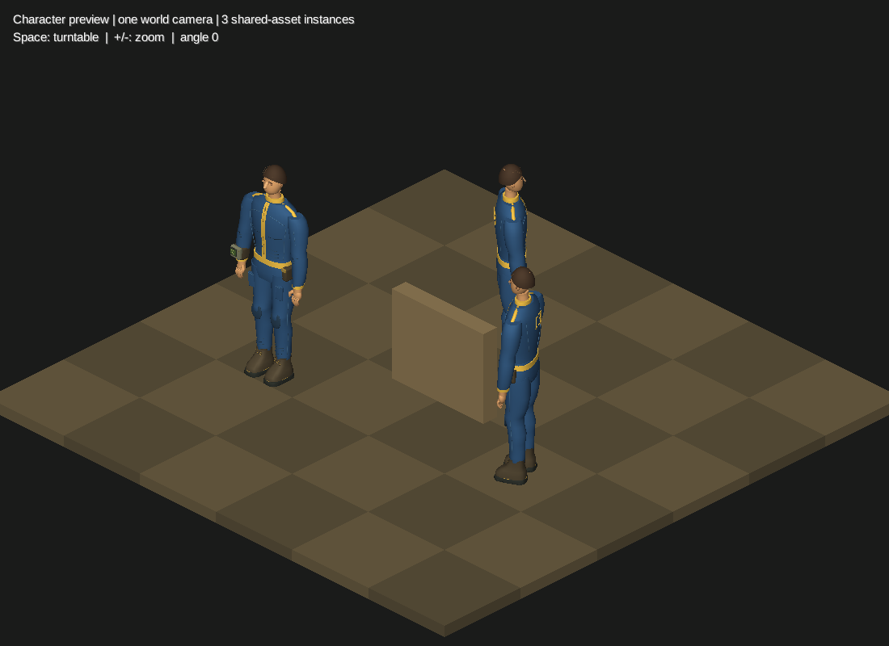
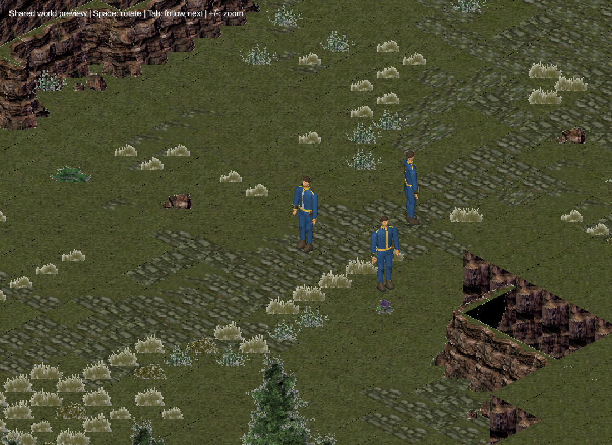

# Blue vault-suit character

The active testing character now follows the blue suit in
[`reference/ref.jpg`](../../reference/ref.jpg): leaner human proportions, visible
face and short hair, muted blue clothing with yellow trim, small wrist terminal,
and utility boots. The previous masked ranger remains in `assets/models/ranger`
as an earlier prototype; it is no longer the active player model.



- [OBJ](../../assets/models/vault_dweller/vault_dweller.obj)
- [MTL — keep beside the OBJ](../../assets/models/vault_dweller/vault_dweller.mtl)
- [Rear view](vault-back.png)
- [Architecture and staged migration plan](architecture.md)

The mesh has 17,348 triangles, 11,444 exported vertices, 173 modeled pieces,
and 16 material groups. Coordinates are Y-up, +Z forward, feet at zero, height
2.212 units (nominal gameplay height 2.2). Facial features, tailoring seams,
folds, reinforced knees, fingers, wrist display, trim and back number are geometry.
The quieter silhouette and palette take priority over adding more small props.

It remains a static prototype: no rig, deformation-ready topology, animations,
texture atlas, or baked ambient occlusion. Materials are matte solid colors;
UVs are local and overlapping. The attempted fabric texture generation failed,
and no generated texture is used. The detailed architecture plan describes the
DCC/rig/atlas/runtime-format work needed for a production character.

Regenerate with Python's standard library:

```sh
python3 tools/generate_vault_dweller.py
```

The generator uses `tools/obj_geometry.py` and writes OBJ, MTL, and descriptive
`model-info.json`. That JSON is asset documentation, not a runtime configuration
loader. Regeneration overwrites generated files; preserve external editor work
separately. The source reference screenshot is not modified.

## Shared world preview

```sh
./gradlew lwjgl3:previewCharacter
```



The development preview now uses the same WorldScene, map importer, renderer and
orthographic camera as BattleScreen. Three characters share one loaded Model
while retaining independent transforms. Space toggles preview rotation, Tab
cycles the followed character, and +/- zooms. Normal battles never rotate actors.

The default view is calibrated to `reference/ref.jpg`: a standing character fills
approximately 16% of the image height at the reference aspect ratio. The viewport
starts at 14.5 × 12 world units and extends horizontally in wider windows. This
makes characters about 21% larger on screen at 1100 × 800 while preserving their
size relative to terrain. The shared 45° azimuth / 30° elevation remains fixed,
so the models and the map keep the same 2:1 dimetric projection at every zoom.



The real mountain-pass map has been migrated to ground meshes, anchored cutouts,
and solid elevation risers sharing the character depth buffer. Scene2D remains
only for the UI. See [architecture.md](architecture.md) for the implementation,
authoring contract, tests and remaining rigging/art work.

## Verification

The Java build and six core architecture/lifecycle tests pass. A desktop smoke test rendered
three actors on the converted map and verified independent player movement,
tracking, zoom, resize and returning from the menu. The earlier model closeups
above remain useful asset previews; [the current battle screenshot](unified-battle.png)
shows the shared world renderer.
