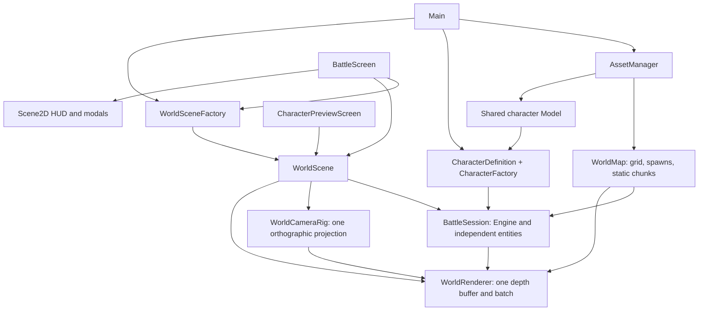
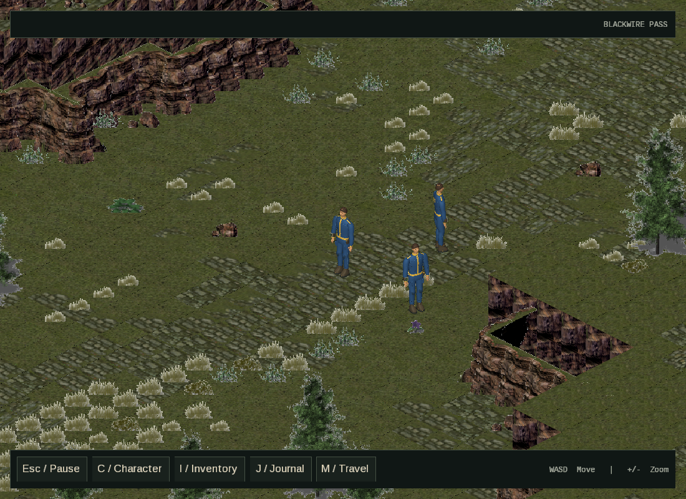

# Characters in one world scene

Implemented: the battle and development preview now use **one orthographic world
camera, one WorldRenderer, one ModelBatch, and one uninterrupted depth buffer**.
There is no perspective character camera, IsometricTiledMapRenderer, or separate
character drawing pass. Tiled is an authoring/input format, not a second renderer.
Scene2D remains exclusively the screen-space HUD/menu/modal layer.

## Runtime structure



Main composes a CharacterFactory and WorldSceneFactory using shared assets.
The frontier catalog declares each destination's WorldMap as a startup dependency.
BattleScreen creates the journey's selected area on entry, disposes the previous
scene when changing areas, and coordinates the active scene with its UI. Menu
return preserves the session; changing or loading a journey replaces it. Player
positions are saved by destination ID and restored only to their corresponding
area. The development preview uses the same factory and scene classes with the
pass map; only its controls and player-input enablement differ. It contains no
separate test terrain, camera, or renderer.

## Responsibilities and ownership

| Type | Responsibility and ownership |
| --- | --- |
| `CharacterDefinition` | Stable appearance ID, model asset path, scale, nominal height and collision radius |
| `CharacterFactory` | Creates per-entity components and a ModelInstance from an injected, shared Model; no asset loading or disposal |
| `BattleSession` | Owns Engine, actor membership, followed actor, simulation update and teardown; references the shared map |
| `WorldSceneFactory` | Creates scenes/sessions from already-loaded shared maps and character assets; never blocks for loading |
| `WorldScene` | Coordinates simulation → camera follow → drawing; owns its WorldRenderer and clears its session on disposal |
| `WorldCameraRig` | Fixed dimetric view, zoom, resize and world-ground picking; never a camera per actor |
| `WorldRenderer` | Owns ModelBatch and lighting; culls static chunks and actor bounds and draws all through the same camera |
| `WorldMapLoader` | Resolves TiledMap/texture dependencies, prepares CPU mesh buffers asynchronously, uploads GPU meshes in loadSync |
| `WorldMapImporter` | Validates authoring data, converts ground/cutouts/risers, builds collision heights and resolves spawns |
| `WorldMap` | AssetManager-owned static map; disposes generated meshes, never the Tiled dependency textures |
| `WorldGrid` | CPU-only terrain height, cell conversion, walkability and collision queries |

ModelInstances share the Model's geometry and texture resources while retaining
independent transforms. Removing actors does not dispose the shared Model.
WorldScene teardown releases its renderer and entities. Main disposes screens
before AssetManager releases shared character/map assets and their dependencies.
The map loader guards partially uploaded models if an upload fails.

## Coordinates, camera and frame order

World X/Z is the ground plane; Y is elevation. A libGDX Tiled cell `(column,row)`
has center `((column + .5) * cellSize, elevation, -(row + .5) * cellSize)`.
The importer is the boundary between authored cells/pixel anchors and world
coordinates. Components never store preprojected isometric screen positions.

The existing ground artwork is 64 × 32 pixels. A fixed 45-degree azimuth and
30-degree elevation produces matching 2:1 diamonds. The camera offset direction
is `(1, sqrt(2/3), 1)`. Changing zoom scales the whole scene equally. Tracking
changes the camera target, not entity coordinates. A true-isometric elevation of
about 35.264 degrees would produce a different diamond ratio.

1. Keyboard input writes movement intent (priority 0) for the selected actor.
   `PlayerControlledComponent` remains the campaign player identity for saving;
   `SelectedComponent` identifies the current command recipient independently.
2. Navigation (priority 1) steers each actor along its own waypoints. A* checks
   cell clearance, diagonal corners and elevation before accepting a route.
3. Movement (priority 2) normalizes intent, limits travel to the next waypoint,
   substeps against blocked cells and height boundaries, and updates facing.
4. ModelTransformSystem (priority 3) synchronizes instance transforms and bounds.
5. WorldScene follows the updated selected actor position.
6. WorldRenderer clears color/depth once and draws static chunks, structures,
   actors, the green selection ring and amber destination ring with one camera.
7. Screen-space UI draws afterward. Its input processor receives events before
   the world input controller; HUD backgrounds also block world clicks.

Input uses the fixed camera's ground-plane right/forward basis. The player moves
at 3 world units/second; diagonal input is normalized. Terrain collision uses a
separate radius, not the visual mesh bounds. Steps over .25 units are blocked.
The current actors are static poses; movement owns their world translation.

WorldCameraRig exposes getPickRay-based ground picking against the actual cell
heights. It returns walkable terrain intersections; it is not yet an object
selection or ray-versus-model feature. Picking is verified at multiple window
sizes and zooms. No new click-to-move control is implied by this API.

## Map authoring contract

`assets/maps/mountinPass.world.json` references its TiledMap, cell size, optional
riser texture patch, and spawn hints. Descriptor rows use Tiled's top-down
convention; the importer converts them to libGDX's flipped row indexing.
Blocked spawn hints search the nearest available walkable cell, keeping actors
separate. A map with no usable spawn fails with an explicit error.

Visible TMX layers declare `worldRole`:

- `ground`: standard 64 × 32 diamond tiles. `worldElevation` sets the surface
  height; mountain-pass levels currently use 0, 2 and 4 units. The world quad's
  UVs sample the diamond's left/bottom/right/top points, not its bounding rectangle.
  Base ground remains below raised surfaces. Small layer offsets avoid coplanar
  flicker. Actual vertical riser faces close height boundaries.
- `cutout`: tall artwork placed as upright world-space planes at explicit ground
  anchors. An optional layer `worldElevation` fixes its base; otherwise props
  use the terrain height. `worldSolid` blocks occupied cells.

TSX properties `worldAnchorX` and `worldAnchorY` define pixel anchors, with Y
measured upward from the sprite bottom. The tree tilesets use trunk/root anchors.
TSX `worldSolid` marks trees and cliff tiles as terrain obstacles; small decoration
atlases remain walkable. Per-object collision shapes are a future refinement.

Ground, cutouts and risers are batched by texture and layer in 16 × 16 cell
chunks. The converted mountain pass currently produces 101 mesh batches, culled
against the same camera frustum. These are map-wide batch counts, not a claim
that all are drawn every frame. The opaque stone patch for risers references
existing atlas pixels; no image file was modified or duplicated.

Cutouts use DefaultShader's alpha-test path. Because that shader only enables
alpha discard with BlendingAttribute, ONE/ZERO blending replaces surviving
pixels while AlphaTest discards transparent ones before they write depth.
Depth writes stay enabled. This avoids rectangular invisible occluders. Truly
translucent effects will need a separate sorted material policy when introduced.

Tile flips and rotations are applied to UV coordinates. Unsupported layer types,
nonzero offsets, non-default opacity/parallax, animated tiles, tall tiles in ground
layers, and unknown roles are rejected explicitly. Add support and tests before
using those Tiled features; the importer does not silently flatten them.

## Screens, input and lifecycle

BattleScreen pauses simulation during application pause or text input. Blocking
menus suspend battle through screen navigation; a hidden battle does not update
or render. Hiding the screen cancels actor routes/movement and detaches the UI/world input
multiplexer. The screen captures the campaign player position into the owning
journey and restores it when entering that area again.
ScreenManager remembers window dimensions and resizes a reused screen before
showing it. Push/pop navigation preserves the existing menu boundary, while
root navigation clears history. Registered/history screens are disposed once.

Battle controls: left-click a scout to select it, then left-click ground to move.
Unreachable/blocked destinations show feedback and preserve the previous route.
WASD overrides the selected scout's route; Tab selects the next scout; +/- zooms;
Escape opens the pause menu. Other scouts keep their own issued routes until
arrival or leaving gameplay. Green marks selection; amber marks the destination.
Picking uses model bounds and terrain intersection from the world camera, so
selection and movement remain aligned through zoom and resize.

```sh
./gradlew lwjgl3:run
./gradlew lwjgl3:previewCharacter
```

The preview enables no player-controlled entity. Space toggles rotation there,
Tab cycles the followed actor, and +/- zooms. It never adds a rotation system to
normal gameplay.

## Verification

`./gradlew build test` passes. The core module now has JUnit 4 tests and a desktop
native dependency confined to test runtime. Six tests cover cell/world conversion,
ground picking across aspect ratios and zoom, normalized movement and blocked
terrain/elevation changes, player-only input with independently moving NPC intent,
per-instance transforms/shared-model ownership, and resize/navigation/disposal of reusable screens.

A desktop smoke harness entered the real battle, rendered three actors with the
converted map, moved the player while checking that NPCs stayed put, changed the
follow target and zoom, resized the window, returned through the main menu, and
exited cleanly. Saved screenshots are in this directory.



## Remaining asset and gameplay work

The requested single-world migration is implemented. The following are separate
production milestones, not alternate rendering paths:

- Rig the vault suit in a DCC tool, create deformation-ready topology/UV atlas,
  bake materials, and author idle/walk/turn clips. OBJ is still a static exchange
  format; choose and validate an animated G3D or glTF pipeline before adding
  AnimationComponent/AnimationController and equipment sockets.
- Replace legacy cutout cliff/tree artwork with authored world meshes where
  necessary. The fixed-camera cutouts and stone risers are a migration bridge;
  some cliff joins and baked perspectives need art cleanup. Camera orbit is
  deliberately unsupported with this artwork.
- Add terrain ramps and per-prop/actor collision shapes beyond the current grid pathfinding.
  Current collision is conservative grid/height collision, not character-to-
  character collision or a physics engine. The extra actors are independent
  entities, not autonomous AI agents.
- Add measured performance budgets, an atlas to reduce character material draw
  calls, animation-specific tests, optional LOD, and repeated map-switch profiling
  when the corresponding gameplay lifecycle exists. Shared assets alone are not
  hardware instancing.
