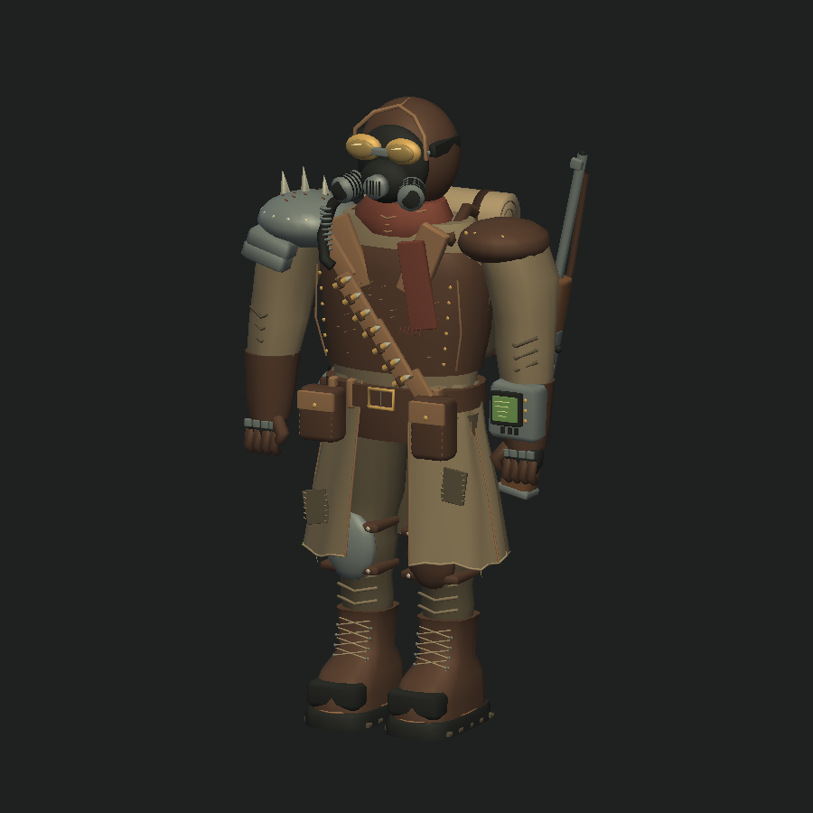

# Wasteland ranger

An archived static character prototype inspired by Fallout 1–2's muted leather, military
surplus, scavenged metal, and chunky retro electronics. All geometry is authored
for this project; no extracted game assets are used.



## Model files

- [Wavefront OBJ](../../assets/models/ranger/wasteland_ranger.obj)
- [Companion MTL](../../assets/models/ranger/wasteland_ranger.mtl)
- [Rear preview](back.png)
- [Battle screen screenshot](in-game.png)

Keep the OBJ and MTL together when importing into Blender or another editor.
The model has 27,992 triangles, 18,186 exported vertices, 460 modeled pieces,
and 16 materials. Geometry is batched by material into 16 groups for libGDX.
Coordinates are Y-up, facing +Z, with the feet at Y=0 and a height of about
2.19 game units. The game's camera target uses a nominal height of 2.2.

Details include a split, repaired duster; layered leather armor; riveted scrap
pauldron; respirator canisters and hose; framed goggles; ammunition sling;
stitched pouches; boot laces and treads; individual glove fingers; a wrist
terminal; canteen; rolled blanket; and a slung rifle with sights and bolt.

This is a static mesh with solid material colors and modeled surface details.
It has no skeleton, walking animation, texture maps, or baked ambient occlusion.
Local UV coordinates overlap and would need an atlas unwrap for texture painting.
Clothes and equipment are separate intersecting shells, not a watertight body
or a topology prepared for skinning. OBJ does not store skeletal animation.

## Editing and regeneration

The asset is reproducible using only Python's standard library:

```sh
python3 tools/generate_ranger.py
```

Edit the generator's material palette and geometry functions to change the
design. Regeneration overwrites both model files; preserve external editor
changes separately. Previews are actual libGDX renders and are not regenerated
by this command.

The active player has been replaced by the [blue vault-suit model](../characters/README.md).
The temporary gameplay rotation system was removed. The new development preview
provides isolated rotation and a shared-camera multi-character scene.

## Verification

`./gradlew build test` succeeds (the project currently has no unit test sources).
The OBJ and all 16 materials were loaded and rendered from three angles in
libGDX, and a temporary desktop harness entered BattleScreen with rotation
enabled, captured the in-game screenshot, and shut down successfully.
